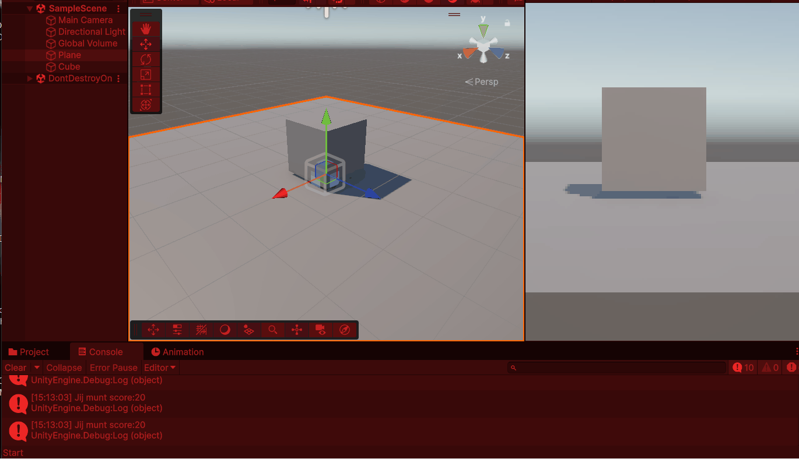
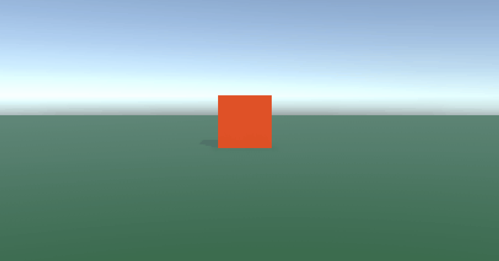
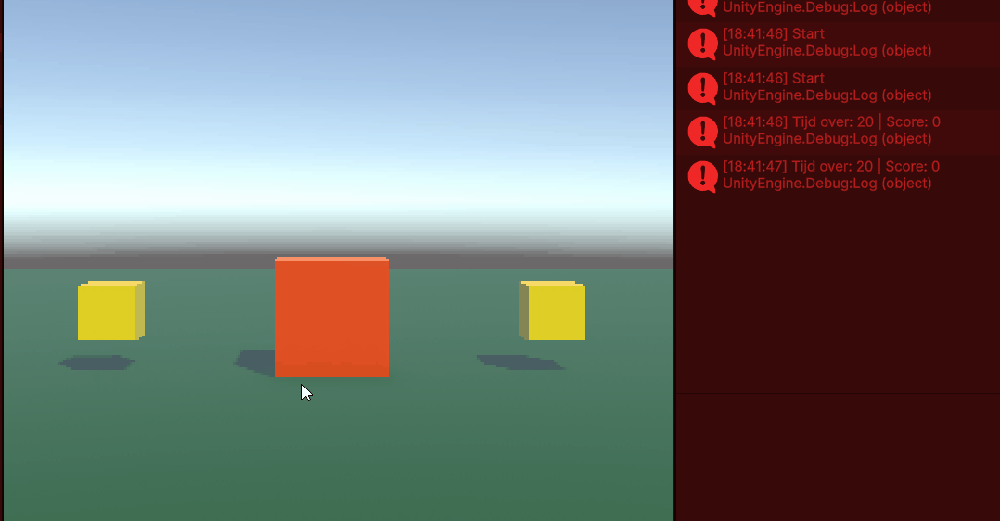
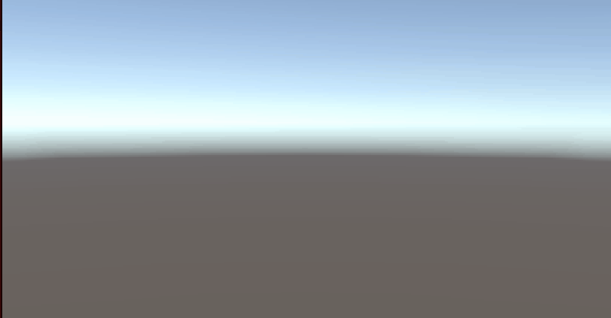
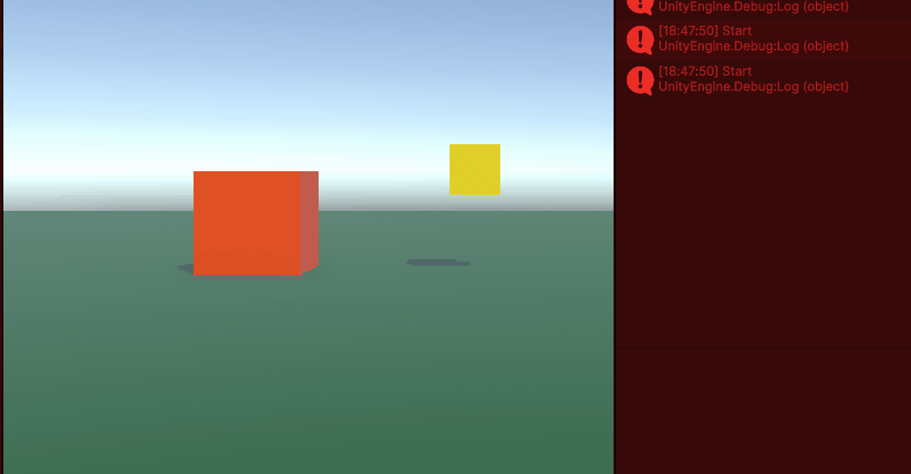
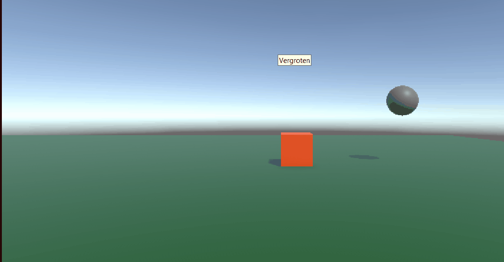

# Les1 Score en Munten

[scriptPlayerScore](Assets/Scripts/PlayerScore.cs)

# Les2 Bewegende Speler

[scriptPlayerControl](Assets/Scripts/PlayerControl.cs	)

# Les3 Timed MuntenJacht

[scriptGameManager](Assets/Scripts/GameManager.cs)

# Les4 Start en Spel

[scriptPlayerControler](Assets/Scripts/PlayerControler.cs.meta)
[scriptSceneSwitcher](Assets/Scripts/SceneSwitcher.cs)

# Les5 Gestructueerde Muntenjager

[scriptPlayerMove](Assets/Scripts/PlayerMove.cs)
[scriptScoreManager](Assets/Scripts/ScoreManager.cs)

# Les6 Volger

[scriptPlayerMovement](Assets/Scripts/PlayerMovement.cs)
[scriptPlayerFollowAndReturn](Assets/Scripts/FollowAndReturn.cs)